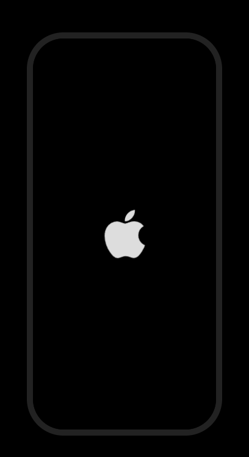
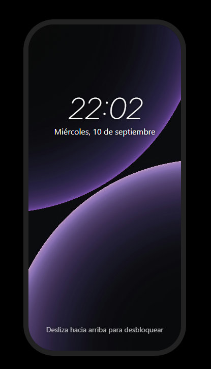
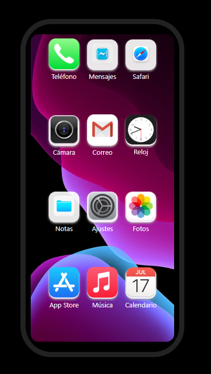

# 📱 Simulador de IPHONE

Panel en forma de movil donde aparece la animacion de inicio de Apple, con su lock screen de la fecha actual.
Deslizas hacia arriba y abre un desktop con aplicaciones (NO FUNCIONAL)

## Tabla de Contenido
## 📖 Tabla de Contenidos
- [ ✨ Características](#-características)
- [ 🛠️ Instalación](#-instalación)
- [ 📸 Capturas](#-capturas)
- [ 💻 Tecnologías](#-tecnologías)
- [ 📜 Licencia](#-licencia)

## ✨ Características
- Animacion de inicio de IPHONE
- Lock Screen con la fecha y hora actual
- Animacion de deslizamiento hacia arriba
- Menu de aplicaciones simulado

## 🛠 Instalación
```bash
git clone https://github.com/Adri-Coding-Dev/Emulator_Mobile
cd Emulador_Mobile
# Abrir index.html en tu navegador favorito
```

## 📸 Capturas
### Menu de inicio con el logo de Apple:

### Lock_Screen

### Menu de Aplicaciones


## 💻 Tecnologías
> HTML5
> CSS3
> JavaScript

## 📜 Licencia
Este proyecto está bajo la licencia MIT